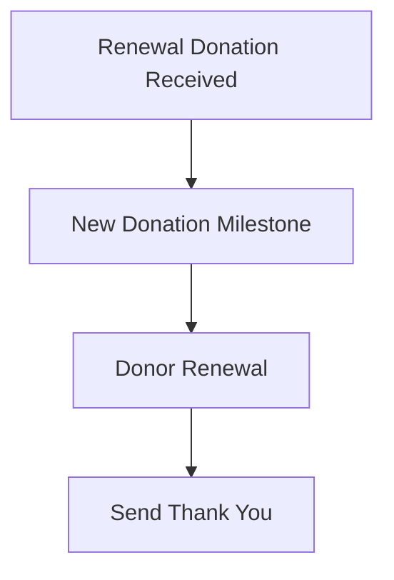

# Workflow Documentation

This document outlines the automated workflows in the system, organized by category.

## Donor Management Workflows

These workflows handle the donor lifecycle from initial contact through active donor status.

### New Donor Candidate Process

```mermaid

%% Define styles globally
classDef redStyle fill:#ff0000,stroke:#333,stroke-width:2px;
classDef blueStyle fill:#0000ff,stroke:#fff;

flowchart TD
    %% New Donor Candidate Process
    title New Donor Candidate Process
    A(New Donor Contact Created/Updated) -->|Stage: donor_candidate| B[New Donor Candidate Welcome/Initial Outreach]
    B --> C[New Donor Confirmed?]
    C --> |Yes| D{{Continue with Donor Activation}}
    C --> |No| E[Send 2nd Outreach]
    E --> F[Send 3rd Outreach]
    F --> |Stage: donor_candidate_stagnant| G[[Standard Donor Candidate Drip]]
```

### New Donor Activation

```mermaid
flowchart TD
    %% New Donor Candidate Confirmed
    A[New Donor Confirmed] -->|Stage: donor_candidate_activation| B[Assign Development Team Member]
    B --> C[Schedule Initial Donor Meeting]
    C --> D[Initial/Follow-up Donor Meeting(s)]
    D --> E[Donation Received?]
    E --> |No| D
    E --> |Yes| F{{Donation Received}}
    F -->|donor_candidate -> donor| G[New Donor Milestone]
    G --> H[Donor Activation]
    H --> I[Send Thank You]
    H --> J[Add to Newsletter]
    H --> K[Schedule 30-day Followup]
    H --> L[Schedule 180-day Followups]
```

### Donor Renewal


