# Workflow Documentation

This document outlines the automated workflows in the system, organized by category.

## Donor Management Workflows

These workflows handle the donor lifecycle from initial contact through active donor status.

### New Donor Candidate Process

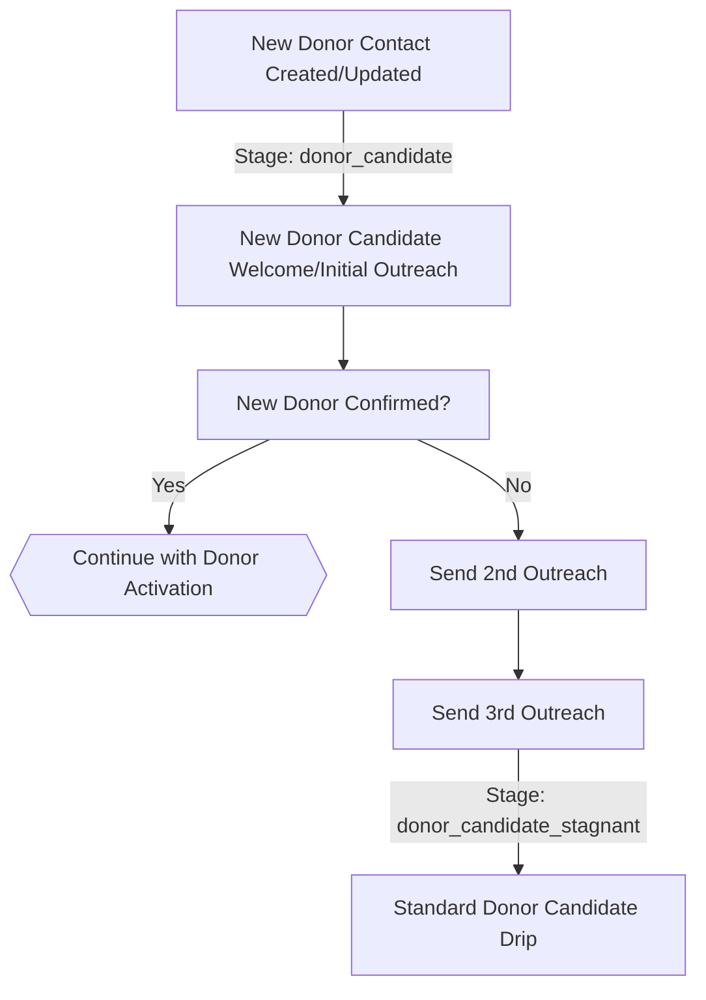

### New Donor Candidate Confirmed

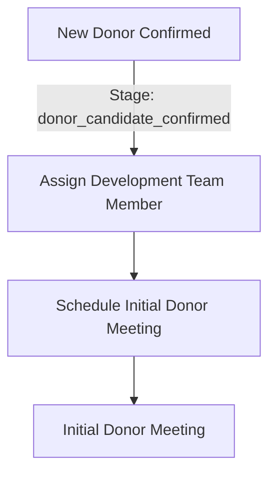

### Donor Activation/Renewal

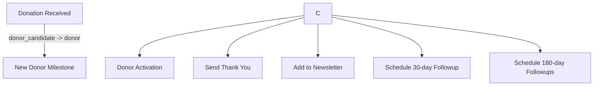

## Neighboring Volunteer Workflows

These workflows manage volunteer recruitment and onboarding processes.

### Neighboring Volunteer Process

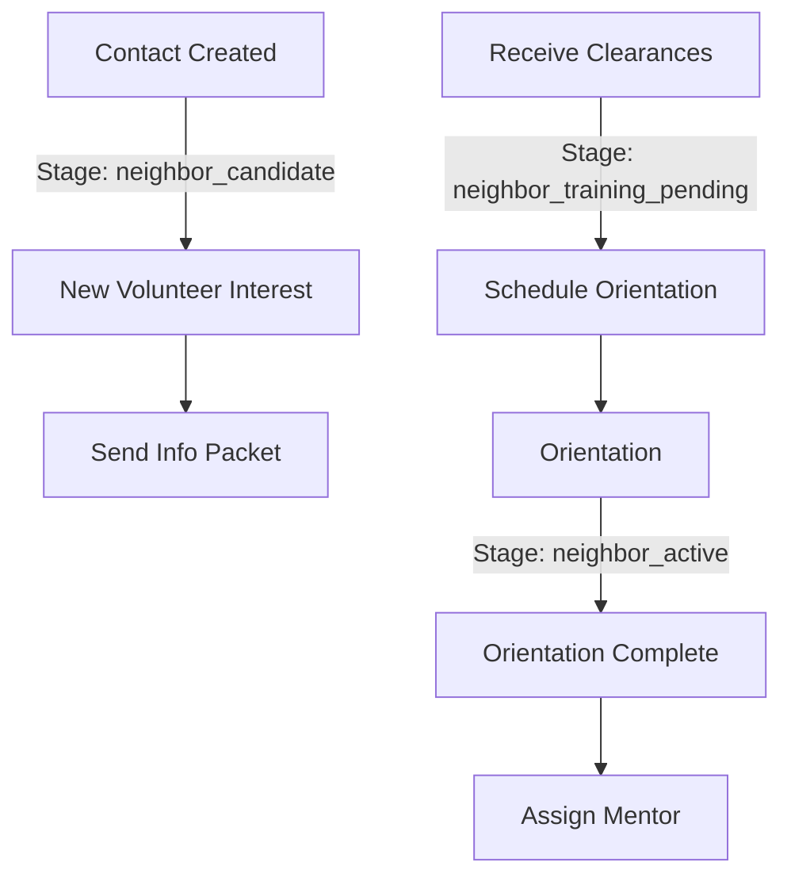

### Volunteer Onboarding

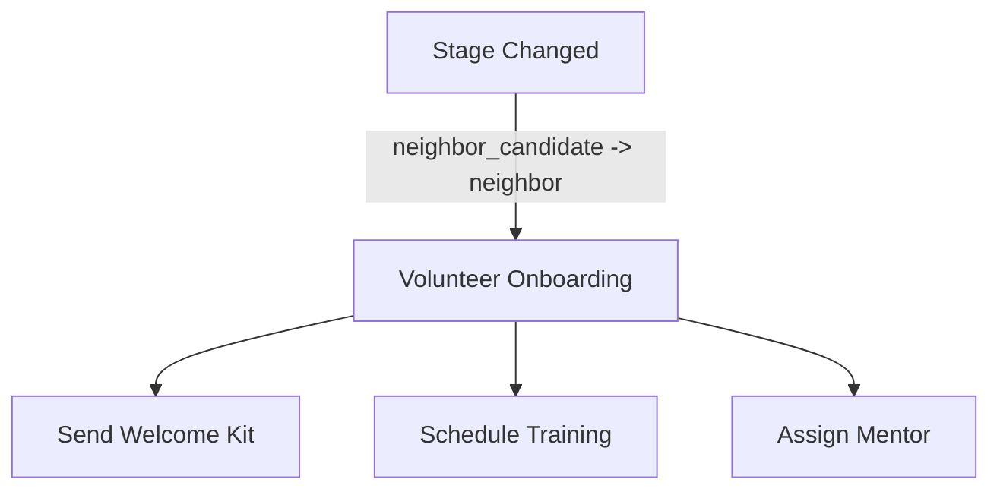

## Mom Program Workflows

These workflows handle the complete journey of program participants from application through graduation.

### Mom Program Flow

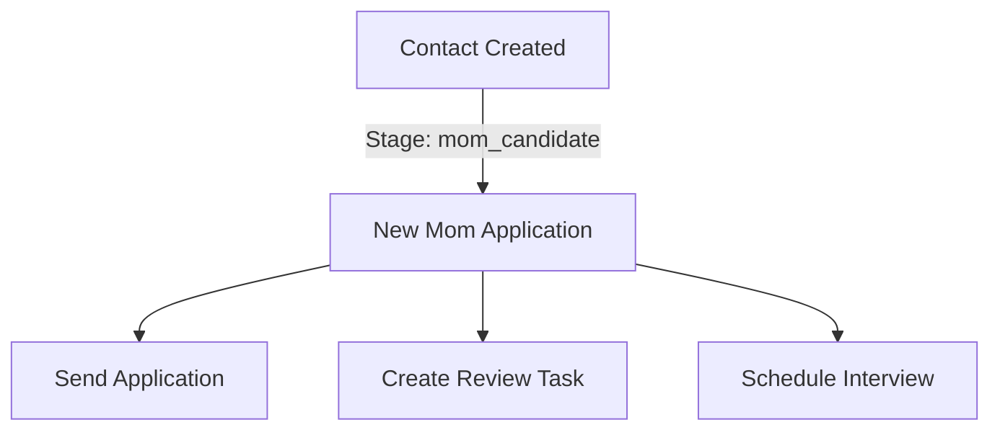

### Mom Acceptance

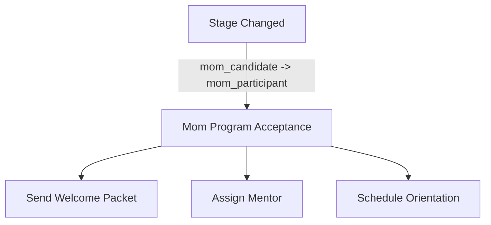

### Mom Graduation

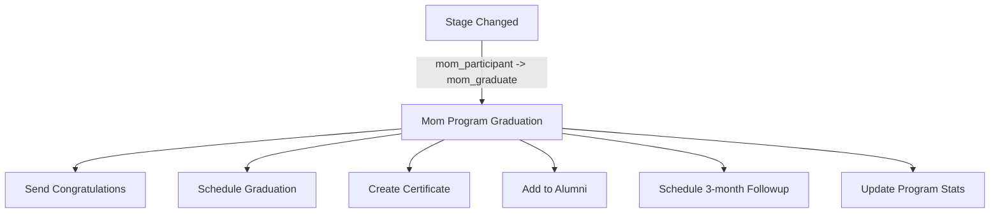

## Gala Event Workflows

These workflows manage various aspects of the gala event, from invitations to auction management.

### Gala Invitation

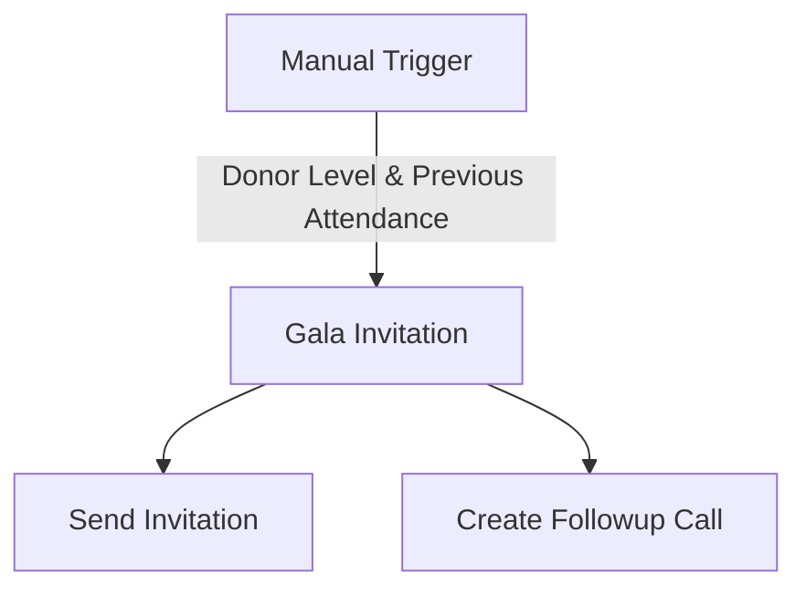

### Gala Registration

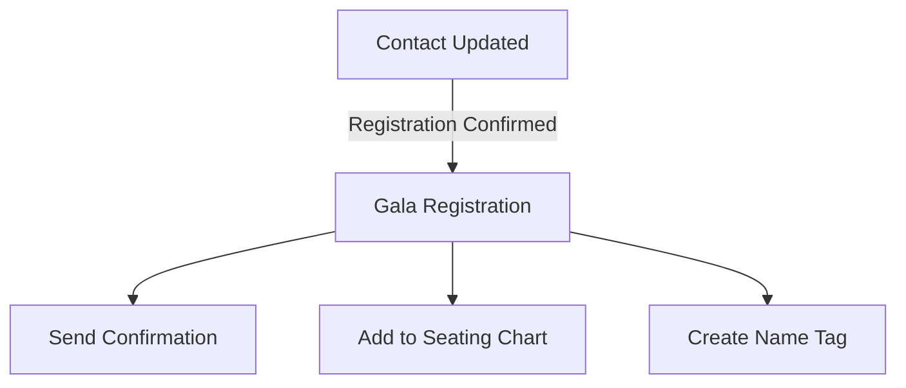

### Auction Winner

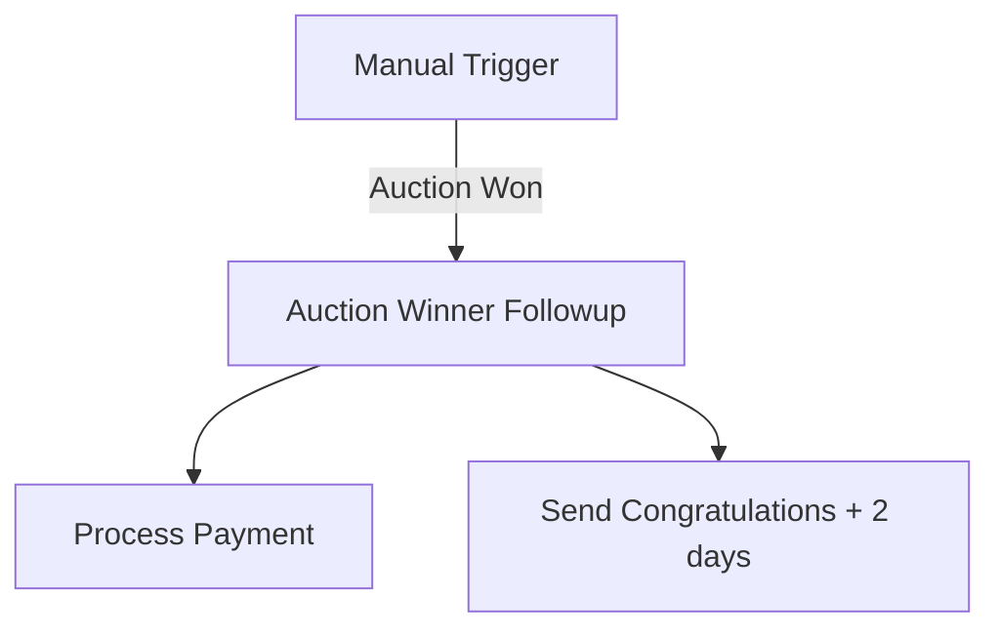

### Neighboring Volunteer Gala Signup

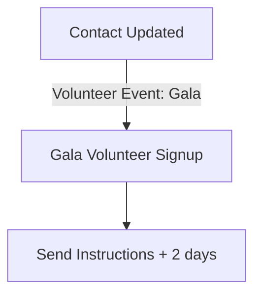

### Workflow Trigger Types

Workflows can be initiated by several types of triggers:

1. **Contact Created** - Triggered when a new contact is added to the system
2. **Contact Updated** - Triggered when specific fields on a contact are modified
3. **Lifecycle Stage Changed** - Triggered when a contact moves from one lifecycle stage to another
4. **Manual** - Triggered by user action
5. **Time-based** - Triggered after a specific time period or at scheduled intervals

## Workflow Actions

Common actions performed by workflows include:

1. **Communication**
   - Send emails
   - Send welcome packets
   - Send congratulations
   
2. **Task Creation**
   - Schedule meetings
   - Create review tasks
   - Set up follow-ups
   
3. **Assignment**
   - Assign team members
   - Assign mentors
   
4. **Program Management**
   - Update contact stages
   - Add to groups/lists
   - Update program statistics
   
5. **Event Management**
   - Schedule orientations
   - Manage event registrations
   - Handle auction processes
